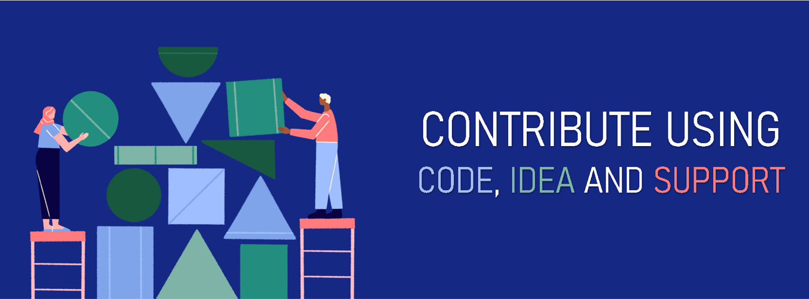

# Bash Woman Community Official Website
This is the main repository of the official website of the Bash Woman Community. It is hosted via Github Pages. Currently, only HTML and CSS is used to create the skeleton of the website. So, it is a one-page static website. However, there are scope to make it multipage web application. In that case, we will probably use JavaScript and Django in future.

 

# Code Description
* ## Current files and folders
  * [index.html](index.html) 
    it is the main html file. It cotains 
    * a sticky nav-bar
        *  brand_logo --auto refreah the **index.html** page
        *  home --linked with **about** section
        *  event --linked with **domains event** section
        *  domain --linked with **domain** section
        *  team --linked with **about team** section
        *  connect --<u>need to link with a Google Form</u>
    * **about** section (first section of the page). It has a button named *Need Help?* for that `we have to create a Google Form which will also work for the connect part of navbar`
    * **domains event** section for displaying top events of the community, each events are linked with a hashnode blogpost. <u> Code-A-Byte is not linked as the blog has not been written yet </u> 
    * **domains** section for displaying our services, currently there are 9 services. <u> Each can be linked with the specific discord channels of the official server</u>. However, the text inside each card element is currently lorem ipsum. So <u>that needs to be changed according to specific domains.</u>
    * **about team** section for displaying info's about our team members (organizer and mentors). It has a button named *Team Members* which will be linked with a new file **team.html**. So <u> we have to create that file as well </u>
    * **sponsor/supporter** section. It has not created yet as we don't have any. But as soon as we have our first supporter, <u>we need to create this section</u> 
    * **footer** part of the website. Contains three segments (ABOUT, USEFUL LINKS, SOCIAL HANDLES). Don't need to change anything until further instruction. 

  * [css](css)  
    A folder that contains all the css files.
    * [common_style.css](css/common_style.css) 
    It contains some font imports, custom scrollbar, some common styling, navbar styling and footer styling with responsive design using media queries.
    * [index.css](index.css)  
    It contains specific styling for the **index.html** file. It has -
        * all similar content styling codes, 
        * section styling with reponsive design
        * first home section (**about**) & meet our team (**about team**) styling with responsive design.
        * Events (**domains event**) & Domains (**domains**) styling with responsive design.
  * [img](img)  
    contains all the images and a [powerpoint file](img/generator.pptx) which is used to edit and design those images.

 

# How to Contribute
Firstly thank you if you want to contribute to this repository. [Note that](), please contact with us in our [Discord](https://discord.gg/R3cnnK6fy9) server or create and [issue](https://github.com/Bash-Woman-Community/website/issues/new) before contributing to the repository.

You may know the 3 easy steps of contribution to a open-source repo like this -
* Fork
* Code
* Pull Request
  
And after going through the code description you may have already understood how can you make contribution or which parts demands your effort. You have to work on the <u>underlined</u> parts mentions above.

Let me quickly recap the tasks for you:
* Create Google Form for connect/Need-Help
* Write Description for each domains and link them with the discord channels
* Create the **team.html** file
  * You can use the basic structure of **index.html** file
  * Link the **common_style.css** file
  * Use the Navbar and Footer
  * Create a **team.css** file in the **css** folder and link it
  * Add your html code in the body part and css code in the **team.css** file
* Create **Sponsor/Supported** section
* Finally, send us suggestions by creating [issues](https://github.com/Bash-Woman-Community/website/issues/new) or directly contribute to enhance the website design, code or performance. 

    This last contribution is the most vital contribution because as we are not **WebDev God**, there is a good probability that we have used bad code in different sections. So, if you help us to solve those code, you will not only contribute to the community but also teach us some good practices of web development.

 

# Special Thanks
* [Web Development Team]() for providing necessary support and suggestions
* [@seema1711](https://github.com/seema1711) for founding this amazing community and doing operational stuffs
* [@plazzy99](https://github.com/plazzy99) for the website design
* [@pandyaved98](https://github.com/pandyaved98) for creating the skeleton structure of the website
* [@ahammadshawki8](https://github.com/ahammadshawki8) for formatting the codes and providing support to make the website live

